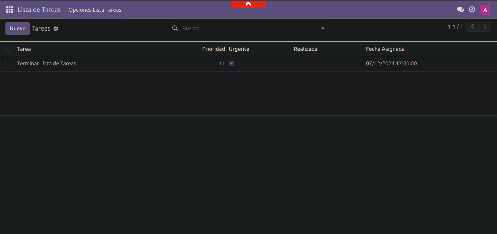
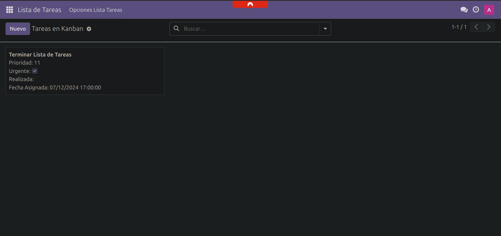
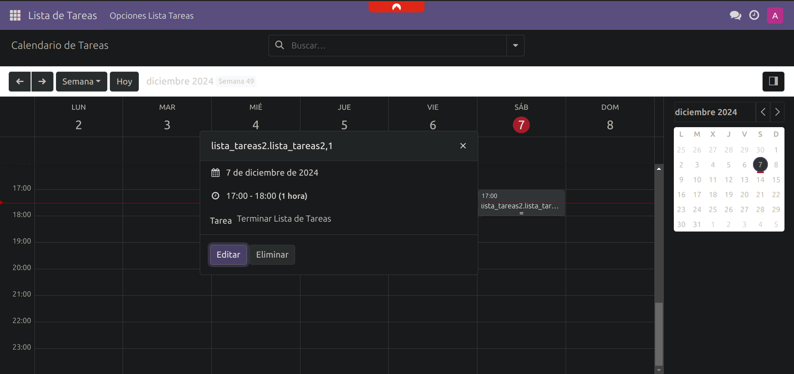

# 📝 Módulo de Tareas - Odoo 17

## 📋 Vista Lista de Tareas
Esta es la típica vista de Odoo, donde puede ver las tareas en una lista normal. Es útil para ver todo de golpe y agregar nuevas tareas con el formulario estándar.

---

## 🃏 Vista tipo Kanban
Aquí las tareas se muestran como tarjetas (tipo Trello, pero más simple). Sirve para organizar visualmente y mover las tareas entre columnas según el flujo.

---

## 🗓️ Vista Calendario
Esta vista pone las tareas en un calendario según su fecha asignada. Es útil para planificar y no perder nada de vista.

---
